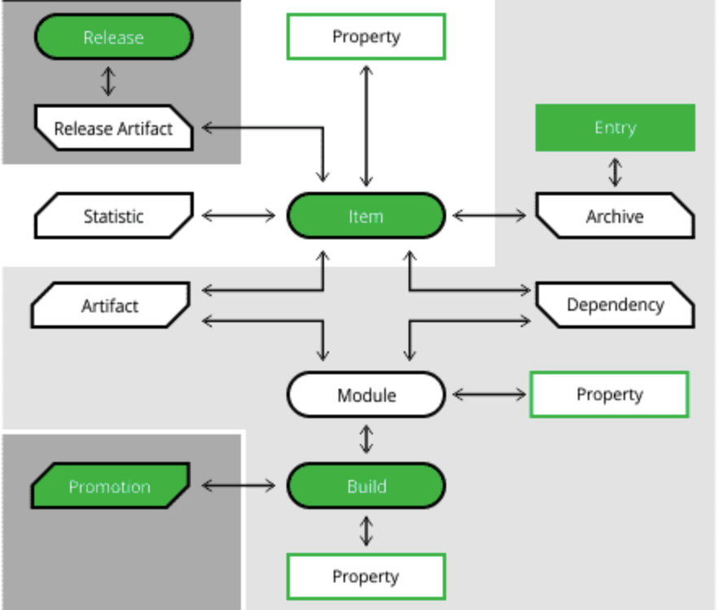

<br/>

[Documentation](https://www.jfrog.com/confluence/display/JFROG/Artifactory+Query+Language).

<br/>

- Powerful query language with JSON-like syntax

- Efficient: translates into optimized DB queries + output streaming

- Universal - any repository type is supported

- Can be used as REST API payloads and in JFrog CLI commands

<br/>


#### AQL Domain Architecture  



<br/>


#### AQL Format

```
<domain>.find(<criteria>)
	.include(<fields>)
	.sort(<order and fields>)
	.offset(<offset records>)
	.limit(<number of records>)
```

<br/>

#### Getting Started

It takes time to develop the expertise – learn by example:

- Start small and incrementally add criteria

- Create a query file and use curl to fine tune AQL Query  
  `curl …. –X POST  <artifactory url>/api/search/aql –T search.aql` 

- Use JFROG CLI to auto generate AQL 

<br/>

---
